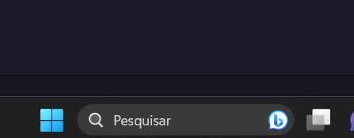

# Trabalho Final
    Trabalho final da disciplina de Algoritmos e Programação 2

# Objetivos gerais
Colocar em prática os conhecimentos aprendidos ao longo da disciplina.

# Objetivos do Programa
Ser capaz de ler um arquivo de texto, remover as spotwords do texto e fazer um sumário das palavras que mais aparecem.

# Especificações do Programa
O programa deve ser executado via `PowerShell`. <br>
Serão passados os caminhos onde estão os arquivos de texto, stopwords e o de saída. <br>
Serão passados também a escolha do arquivo de texto (HTML ou txt) e a quantidade de palavras a serem gravadas no arquivo de saída;

# Para compilar
  vá até a barra de pesquisa da sua máquina e pesquise por `PowerShell`


  depois disso, clique em `Windows PowerShell`; <br>
  logo após faça isso;
  ```
    cd caminho_do_diretorio
  ```
  onde `caminho_do_diretorio` é o caminho da pasta onde o seu código está; <br>
  já dentro da pasta, execute o seguinte comando:
  ```
    gcc -o nome_executavel.exe arquivo_codigo.c
  ```

  onde `nome_executavel.exe` é o nome do executável que será gerado, e `arquivo_codigo.c` é o seu arquivo onde está escrito o código; <br>
  aperte `ENTER` ;<br>
  após o executável ser criado, passe os seguintes comandos:
  ```
    nome_executavel.exe escolha_do_arquivo caminho_arquivo_texto quantidade_de_palavras caminho_arquivo_stopwords caminho_arquivo_saida
  ```
exemplo:


```
xxxx.exe 2 C:\Users\fabri\Algoritmos2\trabalho-final\output\textoingles.txt 2 C:\Users\fabri\Algoritmos2\trabalho-final\output\stopow2.txt C:\Users\fabri\Algoritmos2\trabalho-final\testandoinlges.txt
```
# Observação
 A parte da criação do executável poderia ser feita de outra forma, mas essa foi a que eu escolhi. 

# Conclusão e Agradecimentos
 O trabalho foi desenvolvido em conjunto com mais dois colegas. A maior parte do código foi desenvolvida por mim, sendo assim eles ficaram responsáveis por escrever a documentação do programa. Além da documentação, também ouve uma apresentação para explicar sobre o código. <br> 
 Caso esse repositório tenha sido útil a você, considere deixar uma estrela, e se caso sugir alguma dúvida sobre o desenvolvimento ou sobre alguma funcionalidade, fique a vontade para me perguntar sobre.
 
 


